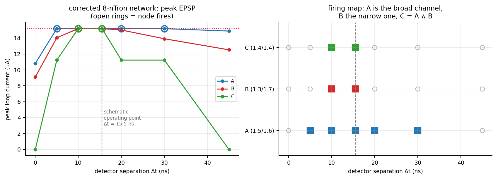
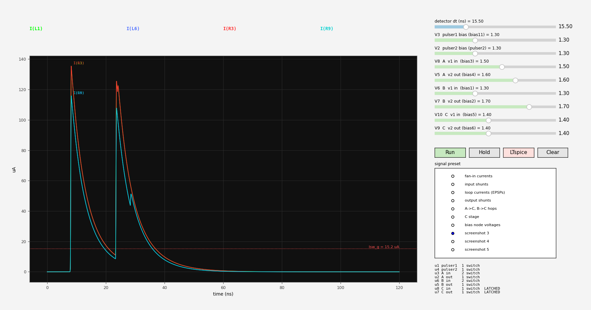
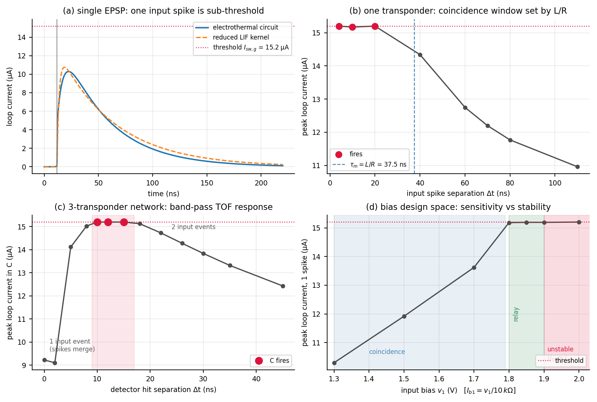

# `ntronpy` — Python reimplementation of the superconducting spiking-transponder circuit

A from-scratch Python model of the LTspice `spiking_transponder_circuit` project,
built to (1) reproduce the multi-transponder dynamics outside SPICE and (2)
collapse the transponder onto a LIF unit with a closed-form trace equation.

This addresses items 1–3 of the Aug-14 to-do list, and feeds Thrust 2 / M2.1
(network simulation framework with variable-delay interconnects).

> **Provenance.** `gitlab.com/spcnc/spiking_transponder_circuit` was not publicly
> reachable, so everything here is transcribed from the uploaded files.
> `SNN_node.lib` is the authoritative artifact — it is the LTspice-exported
> netlist of the transponder, so it could be transcribed line-by-line rather
> than inferred from schematic geometry.

---

## 1. Layout

```
ntronpy/
  ntron.py        port of ntron_2.lib — hotspot growth ODE, kinetic inductance,
                  gate→channel Ic suppression
  circuit.py      backward-Euler MNA engine (R, L, V, delay links, nTron)
  transponder.py  the SNN_node, net names kept verbatim from the .lib
  lif.py          reduced LIF: kernel, closed-form trace, network sim, fitting
scripts/
  run_single.py       one transponder, one input spike
  run_pair.py         coincidence window vs input separation
  scan_bias.py        bias design space (M1.1 / M1.2)
  run_network3.py     the 3-transponder TOF motif
  scan_dt.py          TOF discrimination curve
  check_fanin.py      input-event counting at the fan-in bus
  fit_lif*.py         LIF reduction + held-out validation
  make_figures.py     summary.png
```

Run anything with `python3 scripts/<name>.py`. No dependencies beyond
numpy/scipy/matplotlib.

---

## 2. Numerical method (and why not ngspice)

The point was to have the transponder as a Python object we can sweep,
batch and differentiate — per the Aug-14 note, *"simulate arbitrary networks
with delays etc (NOT in SPICE), at the circuit level."*

Every inductive branch is discretised with a backward-Euler companion model,

```
I_new (L/h + R) = (L/h) I_old + (V_a - V_b)
```

assembled through an incidence matrix so the whole stamp is two matrix
products. **Implicit integration is not optional here**: a gate hotspot puts
650 Ω across 105 pH of kinetic inductance, an L/R constant of 0.16 ps.

Adaptive stepping: 1 ps whenever a hotspot is alive or a branch is near
critical, 100 ps otherwise. Converged — results shift <0.1 % between 2 ps
and 0.25 ps. Nonlinearities (L(I), R(r)) are evaluated at step start
(semi-implicit, no Newton loop); accuracy is carried by the step size instead.

Transmission lines are pure delays. Every `tline` in these schematics is
driven by an ideal source into a 50 Ω = Z0 termination, so |Γ| < 0.3 %.

### The one thing that will silently break a port

**A DC operating point is mandatory.** LTspice runs one implicitly before
`.tran`. The nTrons are biased at ~0.9 of channel Ic; if you instead start
every inductor at zero current, the bias step redistributes over the L/R
constants and the devices sit far below their operating point for tens of ns
— the input nTron's channel never latches at all. This looked exactly like
"the device model is wrong" for a while. `Circuit.operating_point()` fixes it.

---

## 3. How the transponder works

```
IN ─[20Ω]─ N005 ─[5n]─ gate(U2)        U2 = input nTron, drain on `bias1`
bias1 ─[5n]─[R_sh 3Ω]─ gnd             shunt
bias1 ─[R6 4Ω]─[Lb1 148n]─ gate(U1)    the integrating loop
U1 drain = OUT ─[5n]─[R_sh 3Ω]─ gnd    output nTron / readout
```

1. Input spike drives U2's gate past `Isw_g`; the `A1·exp(−(Ig−Isw_g)/β)` term
   collapses U2's channel Ic and a hotspot appears.
2. The bias current `Ib1 = v1/10k`, previously flowing through superconducting
   U2, is forced into the shunt and into the loop.
3. `Lb1` holds it; `R6` bleeds it. **τ_m = L_loop/R_loop = 148.2 nH / 4 Ω =
   37.5 ns** — an L/R leak, not RC, exactly as on slide 7.
4. The loop current *is* U1's gate current. Crossing `Isw_g` = 15.2 µA fires
   U1, dumping `Ib2 = v2/10k` into the output shunt → a ~5.4 mV spike on OUT.
5. U1's gate hotspot damps the loop → reset and refractory.

Derived parameters match hand-checks exactly: `Isw_g` = 15.2 µA, `Isw_c` =
190 µA, ψ = 357.6, v₀ = 106.8 m/s, `Lb1` = 148.206 nH.

---

## 3b. Corrected topology (from `circuit_diagram.pdf`)

The printed schematic resolved the connectivity I could not parse before.
`ntronpy/snn2input.py` now builds the real thing. Six corrections:

1. **The pulse generators do not drive the transponders.** Two single-nTron
   *pulser* stages (U1, U4) sit in between, biased at 1.3 V — the SNSPD front
   ends. A pulser is just the output half of a transponder: gate driven by the
   voltage pulse, drain biased through 10k, drain node shunted by 5n + R_sh and
   tapped as the output. That accounts for 2 of the 8 nTrons.
2. **Both pulsers feed both mid transponders.** A sees pulser1 *and* pulser2
   (R28/R29); B sees the same pair (R16/R23). A and B are two coincidence
   detectors watching the *same* spike pair at *different* biases. My earlier
   "relay front end at v1 = 1.85" was a workaround for a topology that does not
   exist — dropped.
3. **Fan-in has a per-axon inductor**: each line is its own 20 Ω *and* its own
   5 nH, joining only at the gate node.
4. **C's loop resistor is `R30 = {R_loop}`, not `{2.0*R_loop}`** — so
   τ_m(C) = 148.2 nH / 2 Ω = **74 ns**, twice A and B's 37 ns. C is
   deliberately the slow, wide-window node.
5. **Biases**: A = (1.5, 1.6), B = (1.3, 1.7), C = (1.4, 1.4), pulsers 1.3.
6. **No axon delay lines between transponders** — direct wires. Every `tline`
   is on a bias feed or a pulse input. Inter-node delay is device latency only;
   M2.1's variable-delay interconnects are still to be added (`fan_in(...,
   delays=[...])` is the hook).

Input pulses: V4 at 1 ns, V1 at 16.5 ns → **Δt = 15.5 ns**.

### It reproduces the design point



| Δt (ns) | 0 | 5 | 10 | **15.5** | 20 | 30 | 45 |
|---|---|---|---|---|---|---|---|
| A fires (1.5/1.6) | ✗ | ✓ | ✓ | **✓** | ✓ | ✓ | ✗ |
| B fires (1.3/1.7) | ✗ | ✗ | ✓ | **✓** | ✗ | ✗ | ✗ |
| C fires (1.4/1.4) | ✗ | ✗ | ✓ | **✓** | ✗ | ✗ | ✗ |

At the schematic's own Δt = 15.5 ns the whole chain fires — which is the
strongest check available that the corrected model matches the intended design.

A is the **broad** channel and B the **narrow** one; C is their coincidence, so
C ≈ A ∧ B. Two nodes with different biases watching the same spike pair, read
out by a third, is an opponent-channel code for Δt — the sharpness of C's
window comes from the *difference* between two bias settings, not from any one
node being sharp. That is a tuning knob for TOF resolution that costs no extra
hardware.

The Δt = 0 null survives the correction (A and B both register **1** input
event instead of 2), so the spike-*count* finding in §4 stands.

---

## 3d. Verified against the LTspice netlist and waveforms

`ntronpy/snn2_netlist.py` is now a **literal transcription of the expanded
LTspice netlist**, using LTspice's own element and node names. `I(Lb1)` here
is `I(Lb1)` there; `I(R28)` is `I(R28)`; sign conventions match (`I(Rxx)` is
positive from the first node to the second as netlisted).

The netlist corrected two things my visual read of the schematic got wrong:

- **The pulser nTrons are `sq_g = 10` (input type), not `sq_g = 5`.** u1 and
  u4 have `Rnorm_g = 1300`, same as the transponder input nTrons u3/u6/u8;
  only the three *output* nTrons u2/u5/u7 have 650. Twice the gate inductance
  and twice the normal resistance changes the gate switching dynamics.
- **A and B drive C from the shunt junction, not the drain node.**
  `R32 N028 N017` and `R33 N033 N032`, where N017/N032 sit *between* the 5 nH
  output inductor and the 3 Ω shunt resistor. The pulsers, by contrast, tap
  their drain nodes directly (`R28`/`R16` on `bias11`, `R29`/`R23` on
  `pulser2`). So the pulser→transponder hop sees the raw hotspot voltage
  while the transponder→transponder hop sees it low-passed by 5 nH into 3 Ω.
  Two different couplings in one circuit.

And it exposed a bug of mine worth recording: **a DC bias behind a
transmission line must not be delayed.** A lossless line is a short at the
operating point, so a bias that is on at t = 0 stays on. Wrapping it in the
delay switched every bias on at t = Td, threw a >100 µA startup transient
through the shunts, and shifted the whole trace by 5 ns. That single bug was
producing a spurious latch-up and hiding the second spike.

### Quantitative agreement

| signal | LTspice | this model |
|---|---|---|
| `I(R3)` peak | ~135 µA at ~8 ns | **135.40 µA at 8.20 ns** |
| `I(R9)` peak | ~115 µA at ~8 ns | **115.82 µA at 8.22 ns** |
| `I(R28)` peak | ~+27 µA at ~8 ns | **26.63 µA at 7.98 ns** |
| `I(R15)` peak | ~165 µA at ~28 ns | **162.53 µA at 28.74 ns** |
| second event | ~23.5 ns | **23.44 ns** |
| latched trace ~125 µA (screenshot 5) | flat to 60 ns | **`I(R6)` = 124.05 µA, u8 LATCHED** |

The latch-up is the part I would not have predicted and did not fit to: C's
*input* nTron (u8) switches once and never recovers, so `bias5`'s current
stays parked in the 3 Ω shunt. It shows up in both tools at the same
amplitude. Worth deciding whether that is intended behaviour or a bias that
wants lowering — u8 sits at 140 µA against a 190 µA channel Ic.


---

## 3c. Interactive explorer

```
python3 scripts/gui.py          # LTspice-named viewer (primary)
python3 scripts/gui_panels.py   # older 4-panel view, kept for reference
```



Curves carry LTspice element names, listed as coloured labels across the top
the way the LTspice waveform window does, and annotated at each curve's peak.
**Preset** loads the exact signal sets from your screenshots ("screenshot 3",
"fan-in currents", "loop currents (EPSPs)", ...). Sliders drive the detector
Δt and all eight bias sources, each labelled with the source name *and* the
bias net it feeds (`V8  A v1 in (bias3)`). The readout panel lists every
nTron with its switch count and whether it ended latched.

- **Run** solves the full electrothermal circuit (10–150 s depending on how
  much switching happens) and doubles as **Abort** while a solve is live; the
  title shows a progress percentage.
- **Hold** freezes the current traces as a grey ghost so you can drag a bias
  and compare two settings on the same axes.
- **Load LTspice** reads a *File → Export data as text* dump and overlays any
  column whose name matches a plotted signal, as a dashed black line.
- Checkboxes toggle log-y on the EPSP panel and dashed markers at every input
  nTron switching event (which is how you see 1-event vs 2-event behaviour
  directly).

**This is not real-time and cannot be.** The electrothermal solve needs ~10⁵
sub-picosecond steps; sliders respond instantly, the solve does not. If you
want genuinely interactive dragging, that has to run on the reduced LIF model
— which is the natural next step once §5's reduction is validated against the
corrected network.

Needs an interactive matplotlib backend. If you get an "Agg" warning,
`pip install PyQt5` and rerun.

---

## 4. Results



### (a,b) One transponder is a coincidence detector, not a relay

At stock bias a **single** input spike peaks the loop at 10.3 µA against a
15.2 µA threshold — sub-threshold by design. Two spikes inside the L/R window
fire it:

| Δt (ns) | 4 | 10 | 20 | 40 | 60 | 80 | 110 |
|---|---|---|---|---|---|---|---|
| peak I_loop (µA) | 15.20 | 15.17 | 15.20 | 14.34 | 12.75 | 11.77 | 10.96 |
| fires | ✓ | ✓ | ✓ | ✗ | ✗ | ✗ | ✗ |

The window edge sits right at τ_m — the leak *is* the coincidence window.

### (d) Bias design space — M1.1's ≥3 configurations, M1.2's Pareto edge

`v1` (input bias) is the gain knob:

- **v1 ≤ 1.70 V** — coincidence mode (single spike sub-threshold)
- **v1 = 1.80–1.90 V** — relay mode (single spike fires)
- **v1 ≥ 1.90 V** — `Ib1` reaches `Isw_c` = 190 µA, channel self-switches

The usable single-spike window is only ~0.1 V wide. That hard wall at Ic is
the sensitivity-vs-stability trade-off M1.2 asks for, and it should be a
constraint in the ANL Bayesian optimisation rather than something the
optimiser discovers by falling off it.

`v2` (output bias) sets output drive: fires across 1.4–1.85 V with 4.0–5.4 mV
amplitude; fails at 1.90 V.

### (c) The 3-transponder network is a *band-pass* TOF discriminator

Two detector hits → relays A, B (v1 = 1.85) → coincidence node C (v1 = 1.30),
5 ns axons. C fires only for **Δt ∈ [~9, ~17] ns** — including *not* at Δt = 0.

This surprised me, and the mechanism is worth knowing (`check_fanin.py`):

| Δt | C's input-nTron switching events | peak I_loop(C) | C fires |
|---|---|---|---|
| 0 ns | **1** | 9.22 µA | ✗ |
| 12 ns | **2** | 15.20 µA | ✓ |

At Δt = 0 the fan-in bus sums correctly — gate current is *higher* (18.0 vs
16.4 µA), bus voltage doubles (5.29 vs 2.62 mV) — but the nTron is a threshold
device, so **current above `Isw_g` buys nothing**. Both spikes merge into one
switching event and deliver one quantum of charge to the loop.

**The transponder integrates spike *count*, not spike *amplitude*.** Input
amplitude is discarded at the gate; only the number of resolvable switching
events within τ_m matters. That is a real constraint on how information can be
encoded in this hardware — rate/amplitude coding at a node is unavailable —
and it is exactly the polychronous story: the network responds to temporal
patterns, not to summed drive. It also means the *lower* edge of the TOF band
is set by the input nTron's dead time, not by anything in the loop.

---

## 5. The LIF reduction

State variable is the loop current. Closed form for input spikes at `t_k`:

```
I(t) = Σ_k w · η · ( e^(−(t−t_k)/τ_m) − e^(−(t−t_k)/τ_s) )
```

fired when `I ≥ I_th = Isw_g`, then reset and held for `t_ref`.

Fitted on sub-threshold traces (1 spike, and pairs at Δt = 40/80 ns):

| parameter | fitted | interpretation |
|---|---|---|
| τ_m | 50.8 ns | L/R leak; cf. 37.5 ns from `Lb1/R6` alone, 39.6 ns including U2's channel in the return path |
| τ_s | 1.9 ns | hotspot dwell / charge-injection window |
| w | 10.5 µA | peak loop current per input spike |
| I_th | 15.2 µA | `Isw_g` of the output nTron — not fitted, read off the geometry |

Held-out sub-threshold summation: **+8.8 to +9.3 %** over-prediction, consistent
across Δt. A conductance-based variant (`cond_lif_trace`) halves this to
+4.5 to +6.9 %. **Every held-out firing decision was correct.**

Speed: a 10-transponder LIF network over 1 µs runs in **0.55 s**, versus
~25–90 s for a *3*-node electrothermal run over 160 ns. That is the ~10⁴–10⁵×
that makes M2.2 criticality sweeps (avalanche distributions, branching
parameter, RG flow) tractable at all.

---

## 6. Honest caveats

- **Topology is now read off the printed schematic, not the netlist.** I read
  it visually from `circuit_diagram.pdf` at 400 dpi. Component values and nets
  were legible and cross-check against `SNN_node.lib`, but a visual read is not
  a parse — if anything looks off, `File → View → SPICE Netlist` would settle
  it definitively. The older 3-transponder builder (`scripts/run_network3.py`)
  is kept for reference but is **superseded** by `ntronpy/snn2input.py`.
- **§4 and §5 predate the correction.** The single-transponder coincidence
  window, bias design space and LIF fit were all measured on the *old*
  (incorrect) topology with one stimulus path. The device physics and the
  transponder itself are unchanged, so those numbers remain valid statements
  about a single transponder — but the LIF fit has not been redone against the
  corrected network, and the §4(c) "band-pass" plot is from the superseded
  build.
- **The τ_m discrepancy is unresolved.** Fitted 50.8 ns vs 39.6 ns predicted
  from the loop inductance including the return path. The decay is probably not
  a single exponential (loop current redistributes between the 3 Ω shunt and
  U2's channel). A two-exponential decay would likely close it.
- **The conductance-based "reversal current" story does not hold.** E fits to
  42 µA, not the 130 µA of `Ib1` that a driving-force argument predicts. It is
  an empirical saturation scale; I would not build an argument on it.
- **Input dead time is not pinned down.** Single-transponder scans gave a
  non-monotonic event count (2 events at Δt = 1 ns, 1 event at 3 and 5 ns,
  2 events from 6 ns up), which is an artifact of the 2.9 ns stimulus edges
  making a compound gate pulse. The network-level result (1 event at Δt = 0,
  2 at Δt = 12) is solid; the boundary needs a cleaner experiment driving with
  identical relayed spikes on a fine Δt grid.
- `ntron_2.lib` is missing an `S02` switch on the source-segment hotspot that
  the drain side has (`S001`/`S002`), so `r_s` never resets there — almost
  certainly a typo. Default here is the symmetric behaviour;
  `NTron(..., reset_segment_hotspots=False)` restores the literal version.
- Kinetic inductance uses `dΦ/dI` at fixed `r`; the `∂Φ/∂r` cross-term is
  neglected (standard practice, but it is an approximation).
- Axons are ideal delayed buffers — no loading, dispersion or loss. Fine while
  delay is the design variable; revisit if the fan-out budget starts to matter.
- `simulate_lif_network` is smoke-tested only. It has **not** been validated
  against the electrothermal 3-node network — doing that (does the LIF net
  reproduce the Δt ∈ [9,17] ns band?) is the obvious next step, and it needs
  the input-side dead time added as a second refractory.

---

## 7. How to run everything

```bash
cd ntron_py
python3 -c "import numpy, scipy, matplotlib"     # only dependencies

# the corrected 8-nTron network at the schematic's own operating point
python3 scripts/run_snn2input.py 15.5 ref

# a sweep (comma-separated Δt in ns); each point is a separate solve
python3 scripts/run_snn2input.py 0,5,10,20,30 sweep

# long sweeps: run batches in parallel, one process each
for p in "0,5 a" "10,20 b" "30,45 c"; do set -- $p
  nohup python3 -u scripts/run_snn2input.py "$1" "$2" > logs/$2.log 2>&1 &
done

# interactive explorer (needs a GUI backend: pip install PyQt5)
python3 scripts/gui.py

# single-transponder characterisation
python3 scripts/run_single.py        # one spike -> sub-threshold
python3 scripts/run_pair.py          # coincidence window vs Δt
python3 scripts/scan_bias.py         # bias design space
python3 scripts/fit_lif_cond.py      # LIF reduction + held-out validation
python3 scripts/make_figures.py      # regenerate summary.png
```

Runtime: a single 200 ns solve of the 8-nTron network is 15–150 s, dominated by
how many nTrons switch (each hotspot forces 1 ps steps). Sweeps parallelise
across processes cleanly — there is no shared state.

Results land in `figures/` as `.npy` (sweep tables) and `.npz` (full traces);
`snn2input_trace.npz` is what `gui.py` loads if you want to inspect a solve
offline.

## 8. Suggested next steps

1. Redo the LIF fit against the corrected network, including the pulser stage,
   and add input-side dead time to `LIFNeuron`. Then wire the GUI to the
   reduced model for genuinely interactive bias dragging.
2. Add variable-delay axons (`fan_in(..., delays=[...])`) — the schematic has
   none, but M2.1 needs them.
3. Scale to ≥10 transponders, sweep global gain toward criticality, measure
   avalanche statistics (M2.2).
4. Feed the (v1, v2) stability wall to ANL as an explicit optimisation
   constraint.
5. Exploit the A/B opponent-channel structure: sweep the *difference* between
   two nodes' biases and see how sharp C's Δt window can be made.
